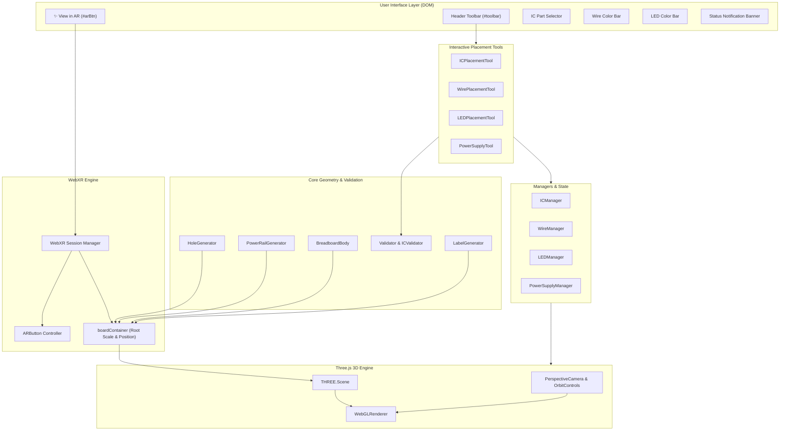
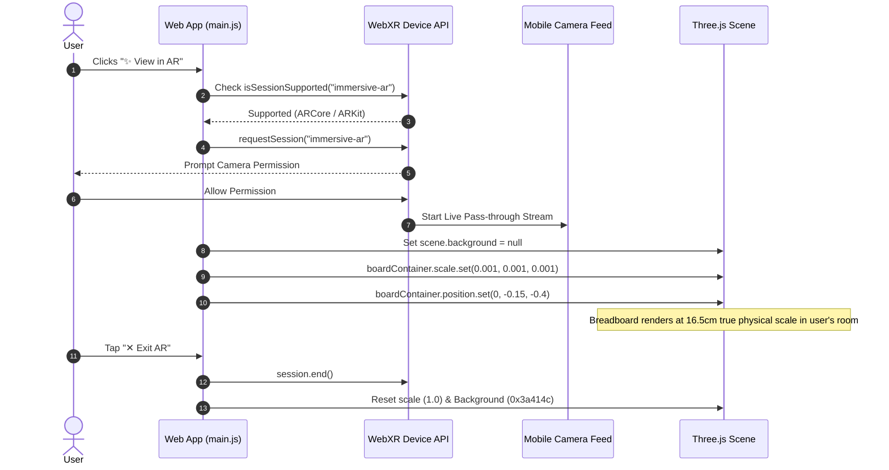

# 🔌 AR Digital Electronics Lab — Breadboard & Hole Engine

An interactive, WebGL and WebXR-powered 3D Digital Electronics Simulator and Solderless Breadboard Engine built with **Three.js**. Supports real-time component placement (DIP ICs, jumper wires, 5mm LEDs, 5V power supply) and immersive **Augmented Reality (AR)** visualization on mobile devices.

🌐 **Live Demo**: [https://ayushdixit1-av.github.io/ar-project/Ayush/](https://ayushdixit1-av.github.io/ar-project/Ayush/)

---

## ✨ Features

- **⚡ Modern 3D Solderless Breadboard**: 630 terminal holes (rows A-J, cols 1-63) + 252 power-rail holes with exact physical spacing ($2.54\text{ mm}$ pitch).
- **👓 Immersive Augmented Reality (AR)**: Real-time WebXR AR viewing mode. Projects a $16.5\text{ cm} \times 5.5\text{ cm}$ breadboard into your physical room using your mobile device's camera.
- **🎛️ IC Component Placement**: Supports DIP-14 / DIP-16 IC logic gates (7400 NAND, 7402 NOR, 7404 Inverter, 7408 AND, 7432 OR, 7411 Triple AND, 74151 MUX, 7486 XOR) with start-hole validation and center-gap checking.
- **🧵 Jumper Wires & Color Coding**: Interactive point-to-point wire routing between any two valid holes with 9 color swatches.
- **💡 5mm LED Placement**: Interactive dual-click placement for Anode (+) and Cathode (-) pins with 5 color options.
- **🔋 5V Power Supply Connection**: Connect power rails ($5\text{V}$ red & Ground black) to breadboard power rows.
- **🏷️ Automated Label & Text Rendering**: Crisp 3D row (A-J) and column (1-63) indicator labels.
- **🛡️ Rule Engine & Validation**: Built-in canonical geometry checkers (`Validator`, `ICValidator`, `WireManager`) verifying pin constraints, short circuits, and hole bounds.

---

## 🏗️ System Architecture



---

## 🔄 User Interaction & Tool Flow

```mermaid
stateDiagram-v2
    [*] --> Idle: Page Load & Viewer Ready

    state ToolSelection {
        Idle --> ICToolActive: Select IC
        Idle --> WireToolActive: Select Wire
        Idle --> LEDToolActive: Select LED
        Idle --> PowerToolActive: Select Power
        Idle --> ARActive: Click ✨ View in AR
    }

    state ICToolActive {
        ICToolActive --> SelectHole: Hover over Breadboard
        SelectHole --> ValidateIC: Click Target Start Hole
        ValidateIC --> PlaceIC: Valid Hole & Orientation
        ValidateIC --> ICToolActive: Invalid (Show Status Error)
    }

    state WireToolActive {
        WireToolActive --> WireStart: Click Start Hole
        WireStart --> WireEnd: Click End Hole
        WireEnd --> PlaceWire: Route Bezier Jumper Mesh
    }

    state LEDToolActive {
        LEDToolActive --> AnodeSelect: Click Anode (+) Hole
        AnodeSelect --> CathodeSelect: Click Cathode (-) Hole
        CathodeSelect --> PlaceLED: Instantiate 5mm LED Mesh
    }

    state ARActive {
        ARActive --> RequestXR: Check navigator.xr
        RequestXR --> InSession: Immersive AR Started
        InSession --> ScaleBoard: Scale board to 0.001 (Meters)
        InSession --> CameraPassThrough: scene.background = null
        InSession --> ExitSession: User clicks ✕ Exit AR
        ExitSession --> Idle: Reset Scale & Background
    }

    PlaceIC --> Idle
    PlaceWire --> Idle
    PlaceLED --> Idle
```

---

## 📱 AR Viewing Workflow



---

## 📁 Directory & File Overview

```
Ayush/
├── index.html              # Main HTML entrypoint & UI toolbar
├── main.js                 # App initialization, Three.js viewer & WebXR setup
├── serve.js                # Lightweight Node.js local static server
├── BreadboardConfig.js     # Single source of truth for physical dimensions (mm)
├── BreadboardBody.js       # 3D plastic chassis generator
├── Hole.js                 # Hole data structure definition
├── HoleGenerator.js        # Terminal strip hole coordinate generator (630 holes)
├── PowerRailGenerator.js   # Power rail hole coordinate generator (252 holes)
├── LabelGenerator.js       # Row/column text label generator
├── IC.js & ICManager.js    # DIP IC models and inventory manager
├── ICPlacementTool.js      # Interactive IC placement logic & preview
├── ICValidator.js          # Pin alignment & boundary validator
├── Wire.js & WireManager.js# Jumper wire state & connection logic
├── WirePlacementTool.js    # Click-to-connect wire routing tool
├── WireRenderer.js         # 3D curved wire mesh generator
├── LED.js & LEDManager.js  # 5mm LED component logic & manager
├── LEDPlacementTool.js     # Dual-hole LED placement tool
├── LEDRenderer.js         # 3D LED bulb & leg rendering
├── PowerSupplyManager.js   # Power supply connection manager
├── PowerSupplyTool.js      # 5V / GND wire hookup tool
└── Validator.js            # Hole engine sanity & self-review checks
```

---

## 🚀 Running Locally

### Prerequisites
- [Node.js](https://nodejs.org/) (v16 or higher)

### Quick Start
1. Clone the repository:
   ```bash
   git clone https://github.com/ayushdixit1-av/ar-project.git
   cd ar-project/Ayush
   ```
2. Start the local server:
   ```bash
   node serve.js
   ```
3. Open your browser and navigate to:
   ```
   http://localhost:8080
   ```

---

## 🕹️ Controls & Shortcuts

| Action | Controls |
| :--- | :--- |
| **Rotate View** | Click & drag with Left Mouse Button |
| **Pan View** | Click & drag with Right Mouse Button |
| **Zoom In/Out** | Scroll wheel |
| **Cancel Placement** | Press <kbd>Esc</kbd> |
| **Undo Component** | Press <kbd>Backspace</kbd> or click **Undo** |
| **Clear All** | Click **Clear** |
| **Toggle AR Mode** | Click **✨ View in AR** |

---

## 🤝 Contributing

Contributions are welcome! Feel free to open an Issue or submit a Pull Request.

---

## 📝 License

This project is open-source and available under the [MIT License](LICENSE).
