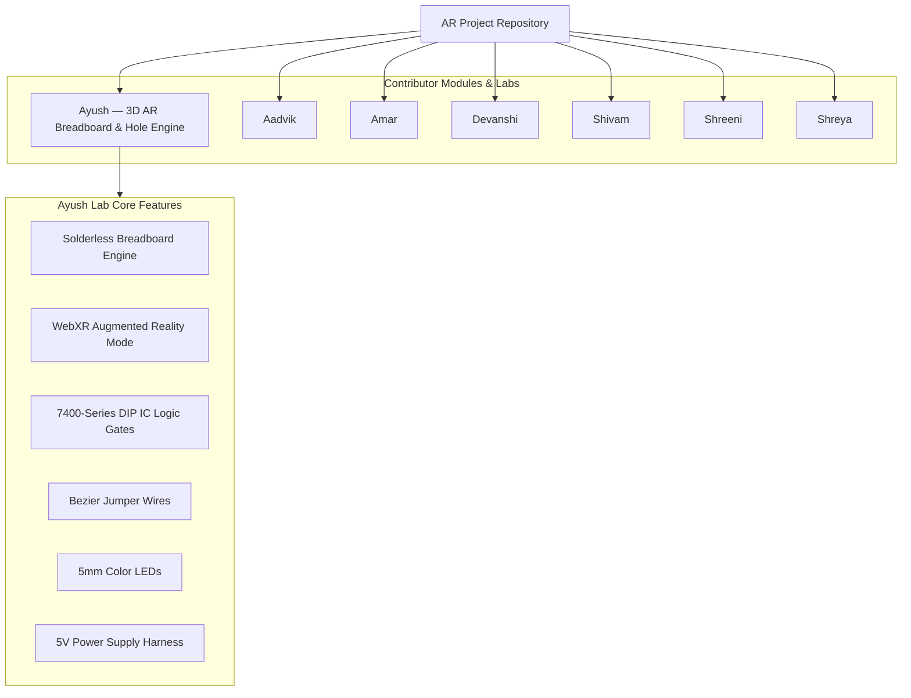

# 🕶️ AR Project — Digital Electronics & AR Experiments

Welcome to the **AR Project** repository! This repository contains WebGL & WebXR Augmented Reality experiments, interactive solderless breadboard simulators, and 3D digital electronics lab components.

🌐 **Live Demo (Ayush Lab)**: [https://ayushdixit1-av.github.io/ar-project/Ayush/](https://ayushdixit1-av.github.io/ar-project/Ayush/)

---

## 🗺️ Project Architecture Overview



---

## 📁 Repository Structure

| Folder | Module / Feature Description |
| :--- | :--- |
| **`Ayush/`** | 3D Interactive Breadboard Simulator with WebXR AR support (`✨ View in AR`), IC placement, wire routing, LED components, and power supply management. |
| **`Aadvik/`** | Experimental AR modules & lab resources. |
| **`Amar/`** | Contributor module. |
| **`Devanshi/`** | Contributor module. |
| **`Shivam/`** | Contributor module. |
| **`Shreeni/`** | Contributor module. |
| **`Shreya/`** | Contributor module. |

---

## ⚡ Getting Started (Ayush Lab)

To run the Ayush AR Digital Electronics Lab locally:

```bash
cd Ayush
node serve.js
```
Then open `http://localhost:8080` in your web browser.

---

## 🤝 Contributing

1. Fork the repository
2. Create your feature branch (`git checkout -b feature/amazing-feature`)
3. Commit your changes (`git commit -m 'Add amazing feature'`)
4. Push to the branch (`git push origin feature/amazing-feature`)
5. Open a Pull Request

---

## 📝 License

Distributed under the MIT License. See `LICENSE` for more information.
